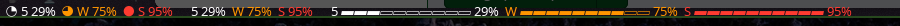

<h1 align="center">polybar-claude-usage</h1>

<p align="center">
  Your Claude plan limits in polybar.
</p>

<p align="center">
  
  
  <a href="LICENSE"></a>
</p>

<p align="center">
  
</p>

A polybar module that shows one small meter for each of your Claude plan's limits, so you can see how close you are before you hit one:

- `5` is the rolling 5-hour session limit.
- `W` is the weekly limit across all models.
- `S`, `O`, `F` and so on are per-model weekly limits (Sonnet, Opus, Fable). They appear once you start using them. `+` is extra usage, if you have it turned on.

These are the same numbers `/usage` shows in Claude Code and **claude.ai › Settings › Usage**. The limits are shared between claude.ai, the Claude apps and Claude Code, so the module shows your usage across all of them.

It's one Python file with no dependencies beyond the standard library.

## What it does

- Four styles: a filling pie (`◔ 5 29%`), plain text (`5 29%`), a small bar (`5 ▰▰▰▱▱▱▱▱▱▱ 29%`), or a single icon (`◔`) that takes the colour and fill of whichever limit is closest to running out.
- A limit turns orange, then red, as you get close to it, following Claude's own reading of each one. Numbers that haven't updated in a while turn grey.
- Left-click sends a notification with exact percentages and when each limit resets. Right-click refreshes.
- Claude Code doesn't need to be open. The module asks your installed Claude Code for its `/usage` report in the background. Claude Code keeps its own sign-in fresh, and the module never sees a token.
- It checks every 5 minutes by default, backs off when Claude rate-limits the checks, and checks again right after a limit resets.
- With one bar per monitor, the bars share one cache and take turns, so three monitors still mean one check.

## Install

You'll need:

- Linux with polybar and Python 3.10 or later
- [Claude Code](https://claude.com/claude-code), signed in once with your Claude Pro, Max, Team or Enterprise account (run `claude` and follow the prompts)
- `notify-send` (from libnotify) for the click-for-details notification
- A font with the meter glyphs. The defaults are all in **Noto Sans Symbols 2** (`noto-fonts` on Arch) and **DejaVu Sans**.

```sh
git clone https://github.com/rogsme/osx-claude-usage.git polybar-claude-usage
cd polybar-claude-usage
make install
```

`make install` copies the script to `~/.local/bin/polybar-claude-usage` (set `BIN_DIR` to change that) and writes a starter config to `~/.config/polybar-claude-usage/config.ini` if you don't have one yet.

Then add the module to your polybar config:

```ini
[module/claude-usage]
type = custom/script
exec = ~/.local/bin/polybar-claude-usage
tail = true
click-left = ~/.local/bin/polybar-claude-usage --notify
click-right = kill -USR1 %pid%
```

Add `claude-usage` to one of your bar's `modules-left`, `modules-center` or `modules-right`. If none of your fonts has the glyphs, polybar logs `Dropping unmatched character` and leaves gaps. Add a font for them:

```ini
font-6 = Noto Sans Symbols 2:size=10;2
```

Restart polybar. To update, `git pull`, run `make install` again and restart polybar.

## Settings

Settings live in `~/.config/polybar-claude-usage/config.ini` (or under `$XDG_CONFIG_HOME`). Every setting is optional, and [`config.example.ini`](config.example.ini) lists them all with their defaults. The module re-reads the file every minute, and right away when you right-click it.

```ini
[display]
style = bar
meters = 5,W
# Quote values that start or end with spaces.
separator = " | "
color_normal = #75d85a
bar_width = 6

[claude]
interval = 600
path = ~/bin/claude
```

| Setting | Default | What it does |
| --- | --- | --- |
| `style` | `pie` | `pie`, `text`, `bar` or `icon` |
| `meters` | `auto` | Which limits to show, by label (`5,W,S`) or id (`seven_day_sonnet`) |
| `separator`, `prefix` | two spaces, empty | Text between limits, and before them all |
| `show_label`, `show_percent` | `true` | Show the `5`/`W` labels and the percentages |
| `pie_glyphs` | `○◔◑◕●` | Pie glyphs from empty to full (two or more) |
| `icon` | empty | The `icon` style's glyph. Empty uses the pie glyph of the limit closest to running out |
| `bar_width`, `bar_chars` | `10`, `▰▱` | Cells in the bar, and the filled and empty characters |
| `color_normal` | empty | Below 70%. Empty keeps the bar's foreground colour |
| `color_elevated`, `color_critical` | `#ff9500`, `#ff3b30` | 70% and over, 90% and over (or whatever Claude says) |
| `color_stale` | `#888888` | Numbers older than 3 intervals (at least 15 minutes) |
| `time_format` | `%H:%M` | Reset times in the notification (strftime) |
| `path` | empty | The `claude` executable. Empty searches PATH and the usual places |
| `interval` | `300` | Seconds between checks, at least 15 |
| `timeout` | `90` | Seconds to wait for Claude Code |

These settings go in this file, not in polybar's `[module/claude-usage]` section, which polybar doesn't pass on to the script.

If you set `icon` to a character that is also an emoji, such as ✳, polybar may draw it with your emoji font, and then it can't change colour. Choose the font with polybar's font tag, numbered from 1 (so `font-6` is `T7`): `icon = %{T7}✳%{T-}`.

You can also try a style without editing the file: `polybar-claude-usage --once --style text`.

A setting with a bad value falls back to its default, and the reason goes to polybar's log.

## Commands

| Command | What it does |
| --- | --- |
| `polybar-claude-usage` | Keeps running and prints a new line whenever the display changes. This is what polybar runs. `SIGUSR1` makes it check now. |
| `polybar-claude-usage --once` | Checks once and prints one line. Useful for debugging, or for a module with `interval` instead of `tail`. |
| `polybar-claude-usage --notify` | Sends a notification with every limit and its reset time. It uses the last result and doesn't run Claude Code. |
| `polybar-claude-usage --details` | Prints the same details to the terminal. |

## Where the numbers come from

Every few minutes the module runs your installed Claude Code with its `/usage` command:

```sh
claude -p /usage --output-format stream-json --verbose --no-session-persistence --safe-mode
```

- `/usage` runs inside Claude Code. No message is sent to a model, so checking usage doesn't use any of it up.
- Claude Code fetches the numbers with its own sign-in and renews that sign-in when needed. The module never reads, stores or sends a Claude token or cookie.
- `--safe-mode` keeps your hooks, plugins and MCP servers from starting, and `--no-session-persistence` keeps the checks out of your session history. Claude Code runs in an empty folder, `~/.cache/polybar-claude-usage/workdir`, so no project's settings apply.
- If your Claude Code is too old to know one of these options, the module drops it and tries again.

The last result is kept in `~/.cache/polybar-claude-usage/state.json` (or under `$XDG_CACHE_HOME`). That lets a restarted polybar show numbers straight away without an extra check.

## Privacy and security

- The module makes no network requests of its own. Claude Code does the fetching, with the sign-in it already has.
- It never reads, stores or sends Claude credentials, tokens or cookies.
- It has no analytics, telemetry or update checks.
- It's one readable file. Start with `fetch_usage` in [`polybar_claude_usage.py`](polybar_claude_usage.py) to see how Claude Code is run.

## Troubleshooting

Run `polybar-claude-usage --once` in a terminal. It prints the line polybar would show, plus the full error on stderr if something failed.

**`Claude: not found`**
Install [Claude Code](https://claude.com/claude-code). If it's installed somewhere unusual, set `path` under `[claude]`. Run `which claude` to find it.

**`Claude: sign in`**
Run `claude` once and sign in with your Claude account. You can quit it afterwards. The module re-checks every minute while signed out, so it recovers on its own.

**`Claude: error`, or the numbers turn grey**
Claude limits how often usage can be checked. The module keeps showing the last known values and retries with a growing delay. If it keeps happening, set a longer `interval`. Updating Claude Code with `claude update` can also help. Left-click shows the last error.

**Gaps where the meters should be**
Your polybar fonts don't have the glyphs. Add Noto Sans Symbols 2 or DejaVu Sans as a `font-N`, or change `pie_glyphs` and `bar_chars` to characters your font has.

## Development

```sh
make test      # unit tests (python3 -m unittest)
make run       # check once and print the line
make install   # copy to ~/.local/bin
```

```
polybar_claude_usage.py   Running Claude Code, reading its usage report, scheduling, rendering
config.example.ini        Every setting, commented out at its default
tests/                    unittest suite, with a trimmed real /usage report in fixtures/
install.sh                Used by make install
```

## Caveats

- The structured usage report Claude Code prints is marked experimental, so its shape may change between Claude Code versions. If it does, the module falls back to reading `/usage`'s text, which has percentages but not reset times.
- Not affiliated with or endorsed by Anthropic. Claude is a trademark of Anthropic, PBC.

## License

[MIT](LICENSE)
